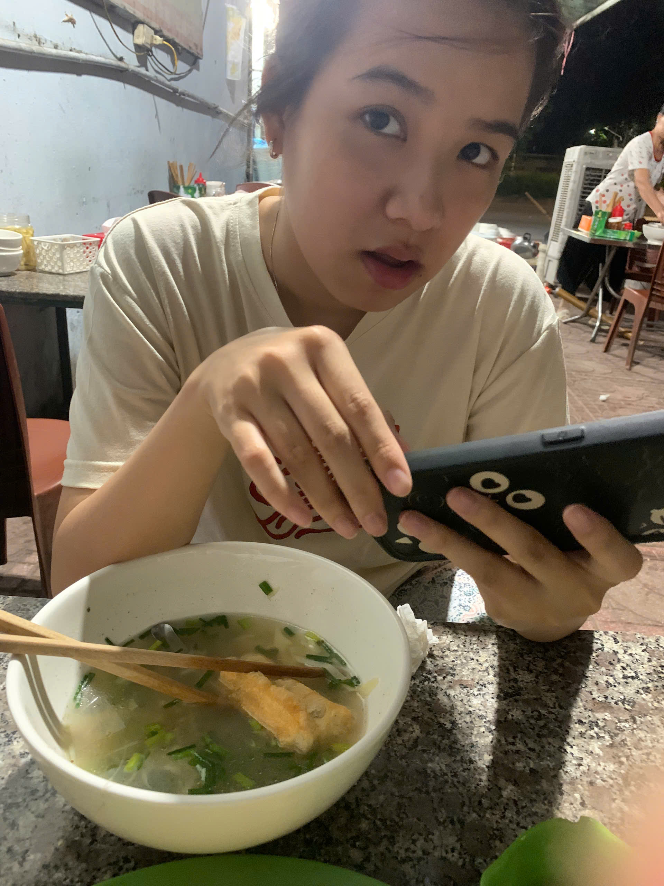
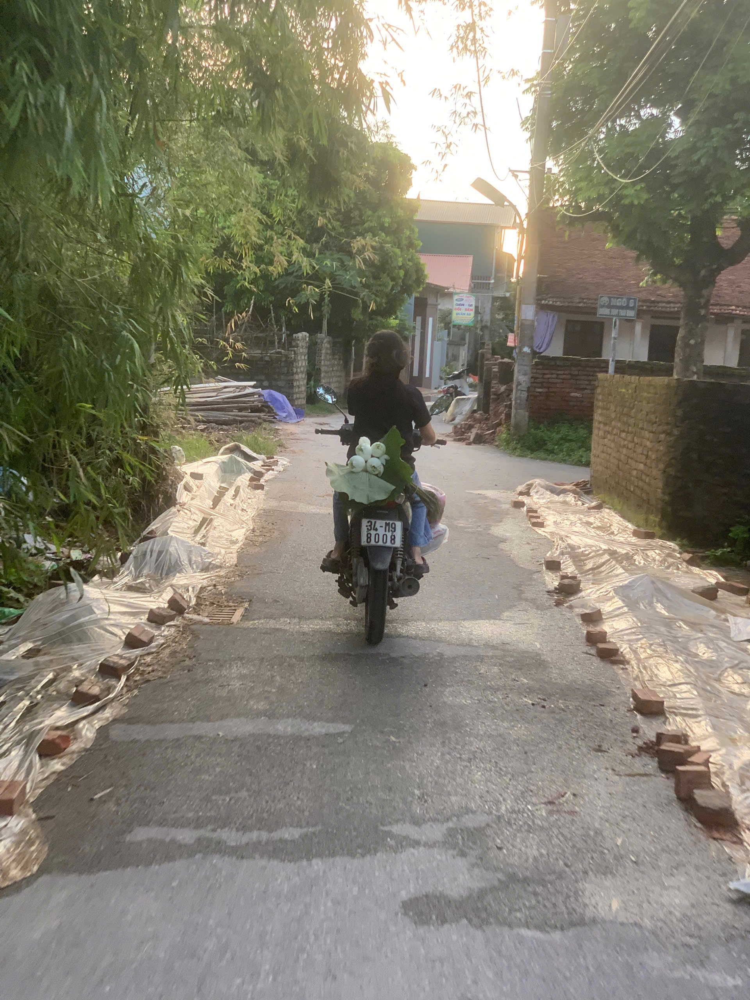
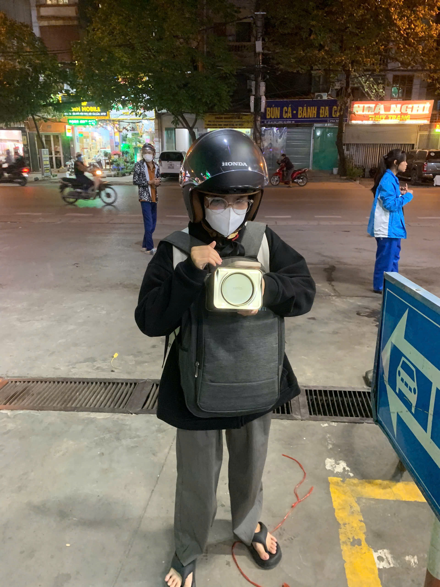

<!DOCTYPE html>
<html lang="vi">
<head>
  <meta charset="UTF-8" />
  <meta name="viewport" content="width=device-width, initial-scale=1" />
  <title>20/10 – Tặng Nguyễn Hương Giang</title>
  <meta name="description" content="Trang web nhỏ xinh tặng Nguyễn Hương Giang nhân ngày 20/10 – Tình yêu bắt đầu từ 16/02/2023." />
  
</head>
<body>
  

  

    <header class="hero">
      

        

          <h1>Chúc mừng 20/10, Nguyễn Hương Giang 💐</h1>
          
Từ ngày <strong>16/02/2023</strong> đến hôm nay, chúng ta đã cùng nhau viết nên thật nhiều điều dễ thương.

          

            ❤ Mãi bên nhau
            🌷 Em là cô gái tuyệt vời nhất
            🎀 20/10 vui vẻ nhé!
          

          

            

0

ngày bên nhau

            

0

giờ yêu thương

            

00:00:00

đếm ngược tới 20/10

          

          

            <button class="btn" id="flowerBtn">Bấm để nhận hoa 🌸</button>

            <!-- Player YouTube -->
            

              

            

          

        

        

          

            
            
            
          

        

      

    </header>

    <section class="section">
      <h2>Gửi Giang yêu dấu</h2>
      

        
Em là món quà tuyệt vời nhất mà anh có được. Mỗi ngày trôi qua kể từ <strong>16/02/2023</strong>, anh càng thấy biết ơn vì có em bên cạnh. Chúc em 20/10 thật rạng rỡ, luôn vui vẻ, khoẻ mạnh và hạnh phúc. Anh hứa sẽ cố gắng để xứng đáng với tình yêu của chúng mình.

        
Thương em nhiều ❤

      

    </section>

    <section class="section">
      <h2>Dòng thời gian nho nhỏ</h2>
      

        
<strong>16/02/2023</strong> – Chính thức yêu nhau. Bắt đầu hành trình đẹp nhất. 🥰

        
<strong>20/10/2023</strong> – 20/10 đầu tiên bên nhau, em cười rất xinh. 💐

        
<strong>2024</strong> – Cùng nhau qua thêm nhiều dấu mốc đáng nhớ. 📸

        
<strong>2025</strong> – Viết tiếp câu chuyện của chúng mình. ✨

      

    </section>

    <section class="section">
      <h2>Album kỷ niệm</h2>
      
Kéo xuống để xem thêm ảnh (thay link ảnh bằng ảnh thật của hai đứa nhé).

      

        
        
        
      

    </section>

    
Made with ❤ dành tặng <strong>Nguyễn Hương Giang</strong> – 20/10

  

  <!-- YouTube IFrame API -->
  
  
</body>
</html>
